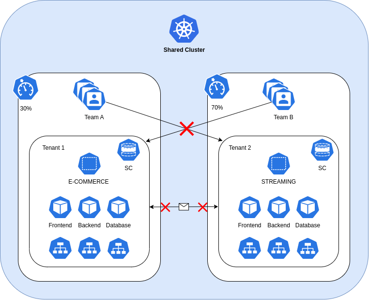

# Here we are!

## Let's try to simulate a scenario using only the native Kubernetes resources

### Namespace per tenant: multi teams



**Lab scenario:**

You've just been hired as a Kubernetes admin and your new company asks you to set up a single Kubernetes cluster to be used by two separate teams.
The only limitation is that you are not allowed to use third-party software due to company policies on vendor lock-in.

In particular the objectives are:

* Each team must have its own dedicated tenant

* Each team must be able to operate and see only their own tenant

* One tenant's workloads must not be able to communicate with those of another

* Each tenant must comply with the assigned maximum usage quotas

* Each tenant must use its own storage class

* Cluster wide resources must be operated only by an admin

---

#### Let's see how we could do it:

[Before you begin, make sure you meet all the lab requirements](./labs-requirement.md)

---

## Let's start by the **Controlplane isolation**

1) **Create the two tenants through their respective namespaces**

```
➜  ~ kubectl create namespace e-commerce 
namespace/e-commerce created
```

```
➜  ~ kubectl create namespace streaming
namespace/streaming created
```

Let's check the two namespaces we just created

```
➜  ~ kubectl get namespace                                
NAME              STATUS   AGE
default           Active   43h
e-commerce        Active   14m
kube-node-lease   Active   43h
kube-public       Active   43h
kube-system       Active   43h
streaming         Active   5m20s
```
---

2) **Ok, now let's focus on the e-commerce tenant**

We need to create the role for regulating the operations that team-1 can perform on the tenant
In detail, it enables the team to manage all resources within the tenant that are not sensitive to isolation security.
For example, the team cannot manage network policies or auth resources such as roles and rolebindings.
Furthermore, the team absolutely cannot operate on cluster-wide resources, such as Storage Class and CRD'S.

[YAML ↓](./team-1-ecommerce/e-commerce-tenant-role.yaml)

```
➜  ~ kubectl apply -f npt/handmade/multi-team/team-1-ecommerce/e-commerce-tenant-role.yaml
role.rbac.authorization.k8s.io/e-commerce-tenant created
```

Let's check the role just created
```
➜  ~ kubectl get role --namespace e-commerce
NAME                CREATED AT
e-commerce-tenant   2024-01-27T13:08:46Z
```

Now we assign the newly created role to the team-1 group through a RoleBinding

[YAML ↓](./team-1-ecommerce/rolebinding-tenant-1.yaml)

```
➜  ~ kubectl apply -f npt/handmade/multi-team/team-1-ecommerce/rolebinding-tenant-1.yaml
rolebinding.rbac.authorization.k8s.io/tenant-1-rolebinding created
```

Check the role binding creation:

```
➜  ~ kubectl get rolebindings.rbac.authorization.k8s.io --namespace e-commerce
NAME                   ROLE                     AGE
tenant-1-rolebinding   Role/e-commerce-tenant   1m
```

Let's try to simulate being a member of team-1

```
➜  ~ kubectl auth can-i get pod --namespace e-commerce --as-group tenant-1 --as john
yes
```

```
➜  ~ kubectl auth can-i get pod --namespace streaming --as-group tenant-1 --as john
no
```

As you can see, a member of team-1 can see the e-commerce namespace but cannot see the streaming namespace (owned by team-2)

---

3) **Ok, now repeat the process to enable team-2 on the streaming tenant**

[YAML ↓](./team-2-streaming/streaming-tenant-role.yaml)

```
➜  ~ kubectl apply -f npt/handmade/multi-team/team-2-streaming/streaming-tenant-role.yaml
role.rbac.authorization.k8s.io/streaming-tenant created
```

[YAML ↓](./team-2-streaming/rolebinding-tenant-2.yaml)

```
➜  ~ kubectl apply -f npt/handmade/multi-team/team-2-streaming/rolebinding-tenant-2.yaml
rolebinding.rbac.authorization.k8s.io/tenant-2-rolebinding created
```

Let's try to simulate being a member of team-2

```
➜  ~ kubectl auth can-i get pod --namespace streaming --as-group tenant-2 --as marta
yes
```

```
➜  ~ kubectl auth can-i get pod --namespace e-commerce --as-group tenant-2 --as marta
no
```

---

4) **Move now to set the tenants resource quotas**

Now that we have taken care of configuring tanant isolation via namespaces and rbac, let's move on to the last step regarding control plane isolation

Create the resoure quota for each tenant

[YAML ↓](./team-1-ecommerce/resource-quota-tenant-1.yaml)

```
➜  ~ kubectl apply -f npt/handmade/multi-team/team-1-ecommerce/resource-quota-tenant-1.yaml
resourcequota/quota-limit-tenant-1 created
```

[YAML ↓](./team-2-streaming/resource-quota-tenant-2.yaml)

```
➜  ~ kubectl apply -f npt/handmade/multi-team/team-2-streaming/resource-quota-tenant-2.yaml
resourcequota/quota-limit-tenant-2 created
```

---

## Now it's the turn of the **Dataplane isolation** 

5) **Let's disable cross namespace networking**

This can be achieved by applying a network policy

To check the current state of networking, let's create two nginx pods in the tenant-1 and tenant-2 namespaces

```
➜  ~ kubectl run test --namespace=e-commerce --image=nginx --labels="app=test" --expose --port=80
Error from server (Forbidden): pods "test" is forbidden: failed quota: quota-limit-tenant-1: must specify limits.cpu for: test; limits.memory for: test; requests.cpu for: test; requests.memory for: test
```

**Now that we have applied resource quotas we are not allowed to create a pod without specifying its limits and requests**

Let's apply a manifest that has configured the limits and requests

[YAML ↓](./team-1-ecommerce/test-network-tenant-1.yaml)

```
➜  ~ kubectl apply -f npt/handmade/multi-team/team-1-ecommerce/test-network-tenant-1.yaml
service/test-network-tenant-1 created
pod/test-network-tenant-1 created
```

[YAML ↓](./team-2-streaming/test-network-tenant-2.yaml)

```
➜  ~ kubectl apply -f npt/handmade/multi-team/team-2-streaming/test-network-tenant-2.yaml
service/test-network-tenant-2 created
pod/test-network-tenant-2 created
```

Now let's try to make the two pod communicate

```
➜  ~  kubectl exec test-network-tenant-1 --namespace e-commerce -- curl  http://test-network-tenant-2.streaming
  % Total    % Received % Xferd  Average Speed   Time    Time     Time  Current
                                 Dload  Upload   Total   Spent    Left  Speed
  0     0    0     0    0     0      0      0 --:--:-- --:--:-- --:--:--     0<!DOCTYPE html>
<html>
<head>
<title>Welcome to nginx!</title>
<style>
html { color-scheme: light dark; }
body { width: 35em; margin: 0 auto;
font-family: Tahoma, Verdana, Arial, sans-serif; }
</style>
</head>
<body>
<h1>Welcome to nginx!</h1>
<p>If you see this page, the nginx web server is successfully installed and
working. Further configuration is required.</p>

<p>For online documentation and support please refer to
<a href="http://nginx.org/">nginx.org</a>.<br/>
Commercial support is available at
<a href="http://nginx.com/">nginx.com</a>.</p>

<p><em>Thank you for using nginx.</em></p>
</body>
</html>
100   615  100   615    0     0   485k      0 --:--:-- --:--:-- --:--:--  600k
```

```
➜  ~ kubectl exec test-network-tenant-2 --namespace streaming -- curl  http://test-network-tenant-1.e-commerce
  % Total    % Received % Xferd  Average Speed   Time    Time     Time  Current
                                 Dload  Upload   Total   Spent    Left  Speed
  0     0    0     0    0     0      0      0 --:--:-- --:--:-- --:--:--     0<!DOCTYPE html>
<html>
<head>
<title>Welcome to nginx!</title>
<style>
html { color-scheme: light dark; }
body { width: 35em; margin: 0 auto;
font-family: Tahoma, Verdana, Arial, sans-serif; }
</style>
</head>
<body>
<h1>Welcome to nginx!</h1>
<p>If you see this page, the nginx web server is successfully installed and
working. Further configuration is required.</p>

<p>For online documentation and support please refer to
<a href="http://nginx.org/">nginx.org</a>.<br/>
Commercial support is available at
<a href="http://nginx.com/">nginx.com</a>.</p>

<p><em>Thank you for using nginx.</em></p>
</body>
</html>
100   615  100   615    0     0   451k      0 --:--:-- --:--:-- --:--:--  600k
```

Both calls are successful

Now let's apply a network policy to both tenant to block cross-namespace traffic

[YAML ↓](./team-1-ecommerce/network-policy-tenant-1.yaml)

```
➜  ~ kubectl apply -f npt/handmade/multi-team/team-1-ecommerce/network-policy-tenant-1.yaml
networkpolicy.networking.k8s.io/deny-from-other-tenant created
```

[YAML ↓](./team-2-streaming/network-policy-tenant-2.yaml)

```
➜  ~ kubectl apply -f npt/handmade/multi-team/team-2-streaming/network-policy-tenant-2.yaml
networkpolicy.networking.k8s.io/deny-from-other-tenant created
```

Now let's repeat the connectivity test

```
➜  ~ kubectl exec test-network-tenant-1 --namespace e-commerce -- curl  http://test-network-tenant-2.streaming --connect-timeout 5
  % Total    % Received % Xferd  Average Speed   Time    Time     Time  Current
                                 Dload  Upload   Total   Spent    Left  Speed
  0     0    0     0    0     0      0      0 --:--:--  0:00:05 --:--:--     0
curl: (28) Failed to connect to test-network-tenant-2.streaming port 80 after 5001 ms: Timeout was reached
```

```
➜  ~ kubectl exec test-network-tenant-2 --namespace streaming -- curl  http://test-network-tenant-1.e-commerce --connect-timeout 5
  % Total    % Received % Xferd  Average Speed   Time    Time     Time  Current
                                 Dload  Upload   Total   Spent    Left  Speed
  0     0    0     0    0     0      0      0 --:--:--  0:00:05 --:--:--     0
curl: (28) Failed to connect to test-network-tenant-1.e-commerce port 80 after 5000 ms: Timeout was reached
```

As you can see, the calls fail.
**Connectivity between tenants has been successfully blocked**

---

6) **Storage isolation**

The next step to isolate tenants at the dataplane level is storage isolation

To do this we will create a dedicated StorageClass for each tenant 

**Note that in a real environment, volume types that use node resources should be avoided**

Let's start by creating a storage class for tenant-1

[YAML ↓](./team-1-ecommerce/storage-class-tenant-1.yaml)

```
➜  ~ kubectl apply -f npt/handmade/multi-team/team-1-ecommerce/storage-class-tenant-1.yaml
storageclass.storage.k8s.io/storage-class-tenant-1 created
```

Since we are working locally and Kubernetes does not yet support dynamic volume provisioning, we will have to manually associate a persistent volume resource with the tenant's storage class

[YAML ↓](./team-1-ecommerce/persistent-volume-tenant-1.yaml)

```
➜  ~ kubectl apply -f npt/handmade/multi-team/team-1-ecommerce/persistent-volume-tenant-1.yaml
persistentvolume/persistent-volume-tenant-1 created
```

Now let's deploy a persistentVolumeClaim that makes use of the storage class we just created, just to make sure everything works

[YAML ↓](./team-1-ecommerce/persistent-volume-claim-tenant-1.yaml)

```
➜  ~ kubectl apply -f npt/handmade/multi-team/team-1-ecommerce/persistent-volume-claim-tenant-1.yaml
persistentvolumeclaim/pvc-tenant-1 created
```

Let's check if it has done the binding correctly

```
➜  ~ kubectl get persistentvolumeclaims --namespace e-commerce
NAME           STATUS   VOLUME                       CAPACITY   ACCESS MODES   STORAGECLASS             AGE
pvc-tenant-1   Bound    persistent-volume-tenant-1   500Mi      RWX            storage-class-tenant-1   3m26s
```

Ok everything seems fine, now let's repeat everything for tenant-2

[YAML ↓](./team-2-streaming/storage-class-tenant-2.yaml)

```
➜  ~ kubectl apply -f npt/handmade/multi-team/team-2-streaming/storage-class-tenant-2.yaml
storageclass.storage.k8s.io/storage-class-tenant-2 created
```

[YAML ↓](./team-2-streaming/persistent-volume-tenant-2.yaml)

```
➜  ~ kubectl apply -f npt/handmade/multi-team/team-2-streaming/persistent-volume-tenant-2.yaml
persistentvolume/persistent-volume-tenant-2 created
```

[YAML ↓](./team-2-streaming/persistent-volume-claim-tenant-2.yaml)

```
➜  ~ kubectl apply -f npt/handmade/multi-team/team-2-streaming/persistent-volume-claim-tenant-2.yaml
persistentvolumeclaim/pvc-tenant-2 created
```

```
➜  ~ kubectl get persistentvolumeclaims --namespace streaming
NAME           STATUS   VOLUME                       CAPACITY   ACCESS MODES   STORAGECLASS             AGE
pvc-tenant-2   Bound    persistent-volume-tenant-2   500Mi      RWX            storage-class-tenant-2   61s
```

Each tenant now has its own storage class, but how can we prevent one tenant from creating a persistent volume claim with the other tenant's storage class?
To do this we need to configure a specific storage quota

With this quota "<storage-class-name>.storageclass.storage.k8s.io/persistentvolumeclaims" we specify the maximum number of PVCs that can be created with a specific storage class.
By setting this value to 0 after setting the storage class name of tenant-2, we can make the scenario proposed above impossible

```
➜  ~ kubectl patch resourcequotas quota-limit-tenant-1 --namespace e-commerce --type merge -p '{"spec":{"hard":{"storage-class-tenant-2.storageclass.storage.k8s.io/persistentvolumeclaims":0}}}' 
resourcequota/quota-limit-tenant-1 patched
```

Let's now try to create a pvc in tenant-1 using the storage class of tenant-2

[YAML ↓](./team-1-ecommerce/test-pvc-storage-class-tenant-2.yaml)

```
➜  ~ kubectl apply -f npt/handmade/multi-team/team-1-ecommerce/test-pvc-storage-class-tenant-2.yaml
Error from server (Forbidden): error when creating "npt/handmade/multi-team/team-1-ecommerce/test-pvc-storage-class-tenant-2.yaml": persistentvolumeclaims "pvc-tenant-1-test-wrong-storage-class" is forbidden: exceeded quota: quota-limit-tenant-1, requested: storage-class-tenant-2.storageclass.storage.k8s.io/persistentvolumeclaims=1, used: storage-class-tenant-2.storageclass.storage.k8s.io/persistentvolumeclaims=0, limited: storage-class-tenant-2.storageclass.storage.k8s.io/persistentvolumeclaims=0
```

As we expected, the operation is blocked

Repeat the same step also for tenant-2

```
➜  ~ kubectl patch resourcequotas quota-limit-tenant-2 --namespace streaming --type merge -p '{"spec":{"hard":{"storage-class-tenant-1.storageclass.storage.k8s.io/persistentvolumeclaims":0}}}'
resourcequota/quota-limit-tenant-2 patched 
```

And check that it works as expected

[YAML ↓](./team-2-streaming/test-pvc-storage-class-tenant-1.yaml)

```
kubectl apply -f npt/handmade/multi-team/team-2-streaming/test-pvc-storage-class-tenant-1.yaml
Error from server (Forbidden): error when creating "npt/handmade/multi-team/team-2-streaming/test-pvc-storage-class-tenant-1.yaml": persistentvolumeclaims "pvc-tenant-2-test-wrong-storage-class" is forbidden: exceeded quota: quota-limit-tenant-2, requested: storage-class-tenant-1.storageclass.storage.k8s.io/persistentvolumeclaims=1, used: storage-class-tenant-1.storageclass.storage.k8s.io/persistentvolumeclaims=0, limited: storage-class-tenant-1.storageclass.storage.k8s.io/persistentvolumeclaims=0
```

---

7) **Node isolation**

Node isolation is another technique that you can use to isolate tenant workloads from each other. 
With node isolation, a set of nodes is dedicated to running pods from a particular tenant and co-mingling of tenant pods is prohibited.

Since we only have one node on our local cluster, we cannot achieve this level of isolation.
Let's look at an example anyway:

Let's imagine we have two node pools

One dedicated to the e-commerce tenant and one dedicated to the streaming tenant

How can these two node pools be assigned to their respective tenant namespaces?

To do this, we need to use an admission controller

What is an admission controller? 

**An admission controller is a piece of code that intercepts requests to the Kubernetes API server prior to persistence of the object, but after the request is authenticated and authorized.
Admission controllers may be validating, mutating, or both. Mutating controllers may modify objects related to the requests they admit; validating controllers may not.**

In detail, we will have to use the "PodNodeSelector" admission controller

As a first step, you need to enable the admission controller on the API server

```
kube-apiserver --enable-admission-plugins=PodNodeSelector
```

Then we need to configure the admission controller for our use case through its dedicated yaml file.

Create the file admission-control.yaml in /etc/kubernetes/adm-control/

```
podNodeSelectorPluginConfig:
  e-commerce: "tenant-1=e-commerce"
  streaming: "tenant-2=streaming"
```

Configure the api server to point to the configuration file 

```
kube-apiserver --admission-control-config-file=/etc/kubernetes/adm-control/admission-control.yaml
```

Now let's prepare the nodes

Let's mark them with the labels we chose earlier

```
kubectl label node tenant-1-0 tenant-1=e-commerce
kubectl label node tenant-1-1 tenant-1=e-commerce
kubectl label node tenant-2-0 tenant-2=streaming
kubectl label node tenant-2-1 tenant-2=streaming
```

Final step: set the annotation on the two tenant namespace

```
kubectl patch namespace e-commerce -p '{"metadata":{"annotations":{"scheduler.alpha.kubernetes.io/node-selector":"tenant-1=e-commerce"}}}'
kubectl patch namespace streaming -p '{"metadata":{"annotations":{"scheduler.alpha.kubernetes.io/node-selector":"tenant-2=streaming"}}}'
```

From now on, all pods created on a tenant will be scheduled on the assigned node pools