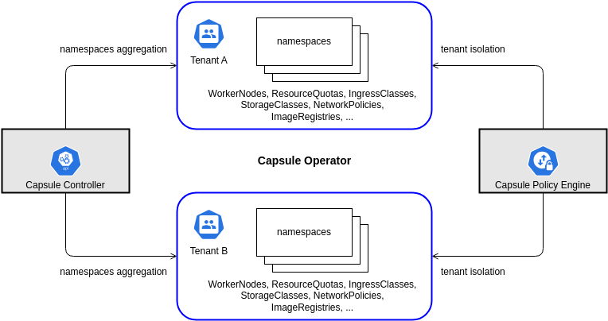

# Here we are!

## Multi-team tenancy with [Capsule](https://capsule.clastix.io/)

### What is capsule?

Capsule is an open source product that implements a multi-tenant and policy-based environment in your Kubernetes cluster. 
It is designed as a micro-services-based ecosystem with the minimalist approach, leveraging only on upstream Kubernetes.

It aggregates multiple namespaces in a lightweight abstraction called Tenant, basically a grouping of Kubernetes Namespaces. Within each tenant, users are free to create their namespaces and share all the assigned resources.

### How capsule works?



Capsule is a Kubernetes operator (Operators are software extensions to Kubernetes that make use of custom resources to manage applications and their components.) composed by two distinct elements:

* The Capsule Controller: aggregates multiple namespaces in a lightweight abstraction called Tenant
* Capsule Policy Engine: keeps different tenants isolated from each other through the use of network and security policies, resource quota, limit ranges, RBAC, and other tenant-defined policies that are automatically inherited by all namespaces in the tenant.


### The lab scenario

Sunnyvale, our organization, is building a Container as a Service platform (CaaS) to serve multiple lines of business, or departments, e.g. Intesa Sanpaolo, Tecnomat, Leory Merlin, Boscolo, Bricocenter. Each department has its team of engineers that are responsible for the development, deployment, and operating of their digital products. Our actors are:

* **Giorgio**: the cluster administrator from the operations department of Sunnyvale.
* **Lorenzo**: the project leader in the Tecnomat & Bricocenter departments. He is responsible for a team made of different job responsibilities: e.g. developers, administrators, SRE engineers, etc.
* **Denis**: the Sunnyvale CTO
* **Alessio**: is the head of engineering for the Intesa Sanpaolo department, the main and historical line of business at Sunnyvale.

---

### Let's start!

[Before you begin, make sure you meet all the lab requirements](./labs-requirement.md)

## 1)  Installation 

Like any software, capsule needs to be installed within the cluster.

To install it, we can take advantage of its helm chart

It will install the Capsule controller in a dedicated namespace capsule-system.

First, we need add the capsule helm repo

```
➜  ~ helm repo add projectcapsule https://projectcapsule.github.io/charts
```

Then update the repo's

```
➜  ~ helm repo update
```

Now, we can install the chart

**Note 1.: if you are using a custom CNI such as calico, you have to set hostNetwork: true in the .yaml valuefile**

**Note 2.: To make the demo work, you need to add an additional capsule group beyond the default one. To do this, add an item to the "capsuleUserGroups" parameter list in the .yaml valuefile**

```
➜  ~ helm install capsule projectcapsule/capsule --values namespace-per-tenant/third-party/multi-team/capsule/helm-values/capsule-values.yaml -n capsule-system --create-namespace
```

Now capsule is installed and we are ready to go

## 2) Assign Tenant ownership

Giorgio, the cluster admin, receives a new request from Denis (the Sunnyvale CTO), asking for two new tenant called Tecnomat and Bricocenter to be onboarded. 

Lorenzo user will be the tenant owner.

```
                                                                                                                 giorgio
➜  ~ kubectl apply -f - << EOF
apiVersion: capsule.clastix.io/v1beta2
kind: Tenant
metadata:
  name: tecnomat
spec:
  owners:
  - name: lorenzo
    kind: User
EOF
tenant.capsule.clastix.io/tecnomat created
```

Giorgio checks the status of the new tenant

```
➜  ~ kubectl get tenant
NAME              STATE    NAMESPACE QUOTA   NAMESPACE COUNT   NODE SELECTOR   AGE
tecnomat          Active 
```

Now that the new tenant is ready, Giorgio sends the access credentials to Lorenzo.

(let's authorize the lorenzo user real quick with a [csr](./users-credentials/create-users.md))

Lorenzo can now log in using his credentials and check if he can create a namespace.

```
➜  ~ kubectl auth can-i create namespaces                                                                         lorenzo-tecnomat-bricocenter
Warning: resource 'namespaces' is not namespace scoped

yes
```

or even delete a namespace within its tenant

```
➜  ~ kubectl auth can-i delete namespace -n test                                                                  lorenzo-tecnomat-bricocenter
Warning: resource 'namespaces' is not namespace scoped

yes
```

However, cluster resources are not accessible to Lorenzo

```
➜  ~ kubectl auth can-i get namespaces                                                                            lorenzo-tecnomat-bricocenter
Warning: resource 'namespaces' is not namespace scoped

no
```

```
➜  ~ kubectl auth can-i get nodes                                                                                 lorenzo-tecnomat-bricocenter
Warning: resource 'nodes' is not namespace scoped

no
```

including the Tenant resources

```
➜  ~ kubectl auth can-i get tenants                                                                               lorenzo-tecnomat-bricocenter
Warning: resource 'tenants' is not namespace scoped in group 'capsule.clastix.io'

no
```


## 3) Create namespace

Lorenzo, after joining his tenant, creates the namespace tecnomat-collector-engine-dev (<tenant-name>-<namespace-name> policy regulated)

```
➜  ~ kubectl create namespace tecnomat-collector-engine-dev                                                       lorenzo-tecnomat-bricocenter
namespace/tecnomat-collector-engine-dev created
```

Giorgio, the cluster admin, remembers that every now and then Lorenzo uses scripts to manage Kubernetes resources.
In the past, one of his scripts went berserk and created 1265 namespaces called banana1, 1banana2, 123banana3 etc.
To ensure that such a situation does not arise again, he decides to apply a limit to the number of namespaces that Lorenzo can create in his tenant

To do this, he apply a patch to the tenant, adding the attribute: 

```
NamespaceOptions: 
    quota: 3
```

```
                                                                                                                  giorgio
➜  ~ kubectl apply -f - << EOF
apiVersion: capsule.clastix.io/v1beta2
kind: Tenant
metadata:
  name: tecnomat
spec:
  owners:
  - name: lorenzo
    kind: User
  namespaceOptions:
    quota: 3
EOF
```

Lorenzo now points out to Giorgio that he has not created the tenant for the other department he manages: bricocenter

Giorgio proceeds to create it

[YAML ↓](./bricocenter-tenant/bricocenter-tenant.yaml)

```
                                                                                                                  giorgio
➜  ~ kubectl apply -f - << EOF
apiVersion: capsule.clastix.io/v1beta2
kind: Tenant
metadata:
  name: bricocenter
spec:
  owners:
  - name: lorenzo
    kind: User
  namespaceOptions:
    quota: 3
EOF                                                                                          
tenant.capsule.clastix.io/bricocenter created
```

Giorgio decides to check the current state of the cluster

```
➜  ~ kubectl get tenant                                                                                          giorgio
NAME          STATE    NAMESPACE QUOTA   NAMESPACE COUNT   NODE SELECTOR   AGE
bricocenter   Active   3                 0                                 82s
tecnomat      Active   3                 1                                 4m27s
```

Now that Lorenzo also has the bricocenter tenant available, he decides to create the "bricocenter-ecommerce-magento-test" namespace

```
➜  ~ kubectl create namespace bricocenter-ecommerce-magento-test                                                lorenzo-tecnomat-bricocenter
namespace/bricocenter-ecommerce-magento-test created
```

## 4) Tenants isolation

**The two tenants remain isolated from each other in terms of resources assignments, e.g. ResourceQuota, Nodes Pool, Storage Classes and Ingress Classes, and in terms of governance, e.g. NetworkPolicies, PodSecurityPolicies, Trusted Registries, etc.**

Lorenzo isn't very confident about tenant network isolation, so he decides to do a simple test:

He proceeds to create an nginx pod on both tenants, calling them test-network-tecnomat and test-network-bricocenter

```
➜  ~ kubectl run test-network-tecnomat --image nginx --port 80 --namespace tecnomat-collector-engine-dev             lorenzo-tecnomat-bricocenter
pod/test-network-tecnomat created

➜  ~ kubectl run test-network-bricocenter --image nginx --port 80 --namespace bricocenter-ecommerce-magento-test 
pod/test-network-bricocenter created
```

He associates an IP cluster service to both pods to allow communication

```
➜  ~ kubectl expose pod test-network-tecnomat --name test-network-tecnomat-svc --namespace tecnomat-collector-engine-dev          lorenzo-tecnomat-bricocenter
service/test-network-tecnomat-svc exposed

➜  ~ kubectl expose pod test-network-bricocenter --name test-network-bricocenter-svc --namespace bricocenter-ecommerce-magento-test
service/test-network-bricocenter-svc exposed
```

He then try to get the two pods to communicate

```
                                                                                                                                  lorenzo-tecnomat-bricocenter
➜  ~ kubectl exec test-network-tecnomat --namespace tecnomat-collector-engine-dev -- curl  http://test-network-bricocenter-svc. bricocenter-ecommerce-magento-test
  % Total    % Received % Xferd  Average Speed   Time    Time     Time  Current
                                 Dload  Upload   Total   Spent    Left  Speed
  0     0    0     0    0     0      0      0 --:--:-- --:--:-- --:--:--     0<!DOCTYPE html>
<html>
<head>
<title>Welcome to nginx!</title>
<style>
html { color-scheme: light dark; }
body { width: 35em; margin: 0 auto;
font-family: Tahoma, Verdana, Arial, sans-serif; }
</style>
</head>
<body>
<h1>Welcome to nginx!</h1>
<p>If you see this page, the nginx web server is successfully installed and
working. Further configuration is required.</p>

<p>For online documentation and support please refer to
<a href="http://nginx.org/">nginx.org</a>.<br/>
Commercial support is available at
<a href="http://nginx.com/">nginx.com</a>.</p>

<p><em>Thank you for using nginx.</em></p>
</body>
</html>
100   615  100   615    0     0   404k      0 --:--:-- --:--:-- --:--:--  600k
```

```
                                                                                                                                  lorenzo-tecnomat-bricocenter
➜  ~ kubectl exec test-network-bricocenter --namespace bricocenter-ecommerce-magento-test -- curl  http://test-network-tecnomat-svc.tecnomat-collector-engine-dev
  % Total    % Received % Xferd  Average Speed   Time    Time     Time  Current
                                 Dload  Upload   Total   Spent    Left  Speed
  0     0    0     0    0     0      0      0 --:--:-- --:--:-- --:--:--     0<!DOCTYPE html>
<html>
<head>
<title>Welcome to nginx!</title>
<style>
html { color-scheme: light dark; }
body { width: 35em; margin: 0 auto;
font-family: Tahoma, Verdana, Arial, sans-serif; }
</style>
</head>
<body>
<h1>Welcome to nginx!</h1>
<p>If you see this page, the nginx web server is successfully installed and
working. Further configuration is required.</p>

<p>For online documentation and support please refer to
<a href="http://nginx.org/">nginx.org</a>.<br/>
Commercial support is available at
<a href="http://nginx.com/">nginx.com</a>.</p>

<p><em>Thank you for using nginx.</em></p>
</body>
</html>
100   615  100   615    0     0   404k      0 --:--:-- --:--:-- --:--:--  600k
```

The test was positive, so Lorenzo points this out to Giorgio

Giorgio forgot to create a policy that isolated tenants at the networking level

He then proceeds to adapt the tenant configuration to the following requirements:

* pods belonging to a tenant namespace cannot access other network infrastructures like cluster nodes, load balancers, and virtual machines running other services.
* deny pods belonging to tecnomat tenant namespaces to access pods in namespaces belonging to the bricocenter tenant

He start with the tecnomat tenant

```
                                                                                                                    giorgio
➜  ~ kubectl apply -f - << EOF
apiVersion: capsule.clastix.io/v1beta2
kind: Tenant
metadata:
  name: tecnomat
spec:
  owners:
  - name: lorenzo
    kind: User
  namespaceOptions:
    quota: 3
  networkPolicies:
    items:
    - policyTypes:
      - Ingress
      - Egress
      egress:
      - to:
        - ipBlock:
            cidr: 0.0.0.0/0
            except:
              - 192.168.0.0/16 
      ingress:
      - from:
        - namespaceSelector:
            matchLabels:
              capsule.clastix.io/tenant: tecnomat
        - podSelector: {}
        - ipBlock:
            cidr: 192.168.0.0/16
      podSelector: {}
EOF
tenant.capsule.clastix.io/tecnomat configured
```

Then move to the bricocenter tenant

```
                                                                                                                    giorgio
➜  ~ kubectl apply -f - << EOF
apiVersion: capsule.clastix.io/v1beta2
kind: Tenant
metadata:
  name: bricocenter
spec:
  owners:
  - name: lorenzo
    kind: User
  namespaceOptions:
    quota: 3
  networkPolicies:
    items:
    - policyTypes:
      - Ingress
      - Egress
      egress:
      - to:
        - ipBlock:
            cidr: 0.0.0.0/0
            except:
              - 192.168.0.0/16 
      ingress:
      - from:
        - namespaceSelector:
            matchLabels:
              capsule.clastix.io/tenant: bricocenter
        - podSelector: {}
        - ipBlock:
            cidr: 192.168.0.0/16
      podSelector: {}
EOF
tenant.capsule.clastix.io/bricocenter configured
```

Giorgio warns Lorenzo of the changes and makes him try again

```
                                                                                                                                lorenzo-tecnomat-bricocenter
➜  ~ kubectl exec test-network-tecnomat --namespace tecnomat-collector-engine-dev -- curl  http://test-network-bricocenter-svc.    bricocenter-ecommerce-magento-test --connect-timeout 5
  % Total    % Received % Xferd  Average Speed   Time    Time     Time  Current
                                 Dload  Upload   Total   Spent    Left  Speed
  0     0    0     0    0     0      0      0 --:--:--  0:00:05 --:--:--     0
curl: (28) Failed to connect to test-network-bricocenter-svc.bricocenter-ecommerce-magento-test port 80 after 5000 ms: Timeout was reached
```

```
                                                                                                                                lorenzo-tecnomat-bricocenter
➜  ~ kubectl exec test-network-bricocenter --namespace bricocenter-ecommerce-magento-test -- curl  http://test-network-tecnomat-svc.tecnomat-collector-engine-dev --connect-timeout 5
  % Total    % Received % Xferd  Average Speed   Time    Time     Time  Current
                                 Dload  Upload   Total   Spent    Left  Speed
  0     0    0     0    0     0      0      0 --:--:--  0:00:05 --:--:--     0
curl: (28) Failed to connect to test-network-tecnomat-svc.tecnomat-collector-engine-dev port 80 after 5001 ms: Timeout was reached
```

The test was negative, Lorenzo is satisfied


## 5) Tenants roles

Denis, the synnyvale CTO, comes to know that the two tenants are been succesfully created.

He ask to Giorgio if he can have access to both, just to see with his own eyes the work of the teams

Giorgio then proceeds to create a user for Denis and assign him with the "view" default cluster role to the two tenats

(let's authorize the denis user real quick with a [csr](./users-credentials/create-users.md))

```
                                                                                                                    giorgio
➜  ~ kubectl apply -f - << EOF
apiVersion: capsule.clastix.io/v1beta2
kind: Tenant
metadata:
  name: tecnomat
spec:
  owners:
  - name: lorenzo
    kind: User
  - name: denis
    kind: User
    clusterRoles:
      - view
  namespaceOptions:
    quota: 3
  networkPolicies:
    items:
    - policyTypes:
      - Ingress
      - Egress
      egress:
      - to:
        - ipBlock:
            cidr: 0.0.0.0/0
            except:
              - 192.168.0.0/16 
      ingress:
      - from:
        - namespaceSelector:
            matchLabels:
              capsule.clastix.io/tenant: tecnomat
        - podSelector: {}
        - ipBlock:
            cidr: 192.168.0.0/16
      podSelector: {}
EOF
tenant.capsule.clastix.io/tecnomat configured
```

```
                                                                                                                    giorgio
➜  ~ kubectl apply -f - << EOF
apiVersion: capsule.clastix.io/v1beta2
kind: Tenant
metadata:
  name: bricocenter
spec:
  owners:
  - name: lorenzo
    kind: User
  - name: denis
    kind: User
    clusterRoles:
      - view
  namespaceOptions:
    quota: 3
  networkPolicies:
    items:
    - policyTypes:
      - Ingress
      - Egress
      egress:
      - to:
        - ipBlock:
            cidr: 0.0.0.0/0
            except:
              - 192.168.0.0/16 
      ingress:
      - from:
        - namespaceSelector:
            matchLabels:
              capsule.clastix.io/tenant: bricocenter
        - podSelector: {}
        - ipBlock:
            cidr: 192.168.0.0/16
      podSelector: {}
EOF
tenant.capsule.clastix.io/bricocenter configured
```

Giorgio tells Denis that his user is ready and that he can access in to see the two tenants

Denis logs in.

To see the current state of the art in the tenants, he try to see which pods are operational in the two namespaces

```
➜  ~ kubectl get pod -n tecnomat-collector-engine-dev                                           denis-tecnomat-bricocenter
NAME                    READY   STATUS    RESTARTS   AGE
test-network-tecnomat   1/1     Running   0          100m
```

```
➜  ~ kubectl get pod -n bricocenter-ecommerce-magento-test                                      denis-tecnomat-bricocenter
NAME                       READY   STATUS    RESTARTS   AGE
test-network-bricocenter   1/1     Running   0          102m
```

Intrigued by the new approach to Kubernetes, he try to see how roles are managed in the namespaces

```
➜  ~ kubectl get role -n bricocenter-ecommerce-magento-test                                     denis-tecnomat-bricocenter
Error from server (Forbidden): roles.rbac.authorization.k8s.io is forbidden: User "denis" cannot list resource "roles" in API group "rbac.authorization.k8s.io" in the namespace "bricocenter-ecommerce-magento-test"
```

Denis remembers the role he was assigned and the resulting limitations, then logs out


## 5) Resource limit and assignments in Tenants

Giorgio receives a new request from Denis:
It is necessary to create a new tenant for the Intesa Sanpaolo department.

This time, however, there are additional requirements that the tenant must satisfy:

* the tenant must be assigned to the user "alessio" which is the head of engineering for the Intesa Sanpaolo department
* the tenant must have a quota of 10 namespaces
* the tenant must be network isolated from other tenant
* the tenant must make use of a dedicated node pool
* the tenant must have a pre-established quota of resources assigned so as to never saturate the nodes beyond 70% (for power consumption reasons)
* the tenant must make use of a dedicated storage partition
* the tenant must not allow the creation of load balancer-type services
* the tenant need to be protected from deletion
* the tenant must have assigned only some secure image registry

Giorgio then starts working on the new tenant point by point

#### 1) the tenant must be assigned to the user "alessio"

Giorgio starts by creating the user alessio and sending him the access credentials

(let's authorize the lorenzo user real quick with a [csr](./users-credentials/create-users.md))

after that, he start creating the tenant and assigning it to alessio

```
                                                                                                                    giorgio
➜  ~ kubectl apply -f - << EOF
apiVersion: capsule.clastix.io/v1beta2
kind: Tenant
metadata:
  name: intesa-sanpaolo
spec:
  owners:
  - name: alessio
    kind: User
EOF
tenant.capsule.clastix.io/intesa-sanpaolo created
```

#### 2) the tenant must have a quota of 10 namespaces

Giorgio add the required quota to the tenant 

```
                                                                                                                    giorgio
➜  ~ kubectl apply -f - << EOF
apiVersion: capsule.clastix.io/v1beta2
kind: Tenant
metadata:
  name: intesa-sanpaolo
spec:
  owners:
  - name: alessio
    kind: User
  namespaceOptions:
    quota: 10 
EOF
tenant.capsule.clastix.io/intesa-sanpaolo configured
```

#### 3) the tenant must be network isolated from other tenant

Giorgio applies a network policy to only allow intra-tenant communication

```
                                                                                                                    giorgio
➜  ~ kubectl apply -f - << EOF
apiVersion: capsule.clastix.io/v1beta2
kind: Tenant
metadata:
  name: intesa-sanpaolo
spec:
  owners:
  - name: alessio
    kind: User
  namespaceOptions:
    quota: 10 
  networkPolicies:
    items:
    - policyTypes:
      - Ingress
      - Egress
      egress:
      - to:
        - ipBlock:
            cidr: 0.0.0.0/0
            except:
              - 192.168.0.0/16 
      ingress:
      - from:
        - namespaceSelector:
            matchLabels:
              capsule.clastix.io/tenant: intesa-sanpaolo
        - podSelector: {}
        - ipBlock:
            cidr: 192.168.0.0/16
      podSelector: {}
EOF
tenant.capsule.clastix.io/intesa-sanpaolo configured
```

#### 4) the tenant must make use of a dedicated node pool

Giorgio starts by assigning a specific label to the nodes involved (we are local, we will do it with the single node)

```
➜  ~ kubectl label nodes minikube "pool"="intesa-sanpaolo"                                                  giorgio
node/minikube labeled
```

the proceeds to create a nodeselector on the tenant

```
                                                                                                                    giorgio
➜  ~ kubectl apply -f - << EOF
apiVersion: capsule.clastix.io/v1beta2
kind: Tenant
metadata:
  name: intesa-sanpaolo
spec:
  owners:
  - name: alessio
    kind: User
  namespaceOptions:
    quota: 10 
  networkPolicies:
    items:
    - policyTypes:
      - Ingress
      - Egress
      egress:
      - to:
        - ipBlock:
            cidr: 0.0.0.0/0
            except:
              - 192.168.0.0/16 
      ingress:
      - from:
        - namespaceSelector:
            matchLabels:
              capsule.clastix.io/tenant: intesa-sanpaolo
        - podSelector: {}
        - ipBlock:
            cidr: 192.168.0.0/16
      podSelector: {}
  nodeSelector:
    pool: intesa-sanpaolo
    kubernetes.io/os: linux
EOF
tenant.capsule.clastix.io/intesa-sanpaolo configured
```

#### 5) the tenant must have a usage limit of up to 70% of the total node-pool resources

Giorgio exploits the tenant's resource quota and assigns a limit of 5.5 CPU and 3 GB in total to be shared by each namespace of the tenant

```
                                                                                                                    giorgio
➜  ~ kubectl apply -f - << EOF
apiVersion: capsule.clastix.io/v1beta2
kind: Tenant
metadata:
  name: intesa-sanpaolo
spec:
  owners:
  - name: alessio
    kind: User
  namespaceOptions:
    quota: 10 
  networkPolicies:
    items:
    - policyTypes:
      - Ingress
      - Egress
      egress:
      - to:
        - ipBlock:
            cidr: 0.0.0.0/0
            except:
              - 192.168.0.0/16 
      ingress:
      - from:
        - namespaceSelector:
            matchLabels:
              capsule.clastix.io/tenant: intesa-sanpaolo
        - podSelector: {}
        - ipBlock:
            cidr: 192.168.0.0/16
      podSelector: {}
  nodeSelector:
    pool: intesa-sanpaolo
    kubernetes.io/os: linux
  resourceQuotas:
    scope: Tenant
    items:
    - hard:
        limits.cpu: "5.5"
        limits.memory: 3Gi
        requests.cpu: "1"
        requests.memory: 1Gi
EOF
tenant.capsule.clastix.io/intesa-sanpaolo configured
```

#### 6) the tenant must make use of a dedicated storage partion

To achieve this goal, Giorgio first creates a storage class for the tenant

```
                                                                                                                    giorgio
➜  ~ kubectl apply -f - << EOF
apiVersion: storage.k8s.io/v1
kind: StorageClass
metadata:
  name: intesa-sanpaolo-storage-class
provisioner: kubernetes.io/no-provisioner
EOF
storageclass.storage.k8s.io/intesa-sanpaolo-storage-class created
```

then, he assign it to the tenant using the "storageClasses" section

```
                                                                                                                    giorgio
➜  ~ kubectl apply -f - << EOF
apiVersion: capsule.clastix.io/v1beta2
kind: Tenant
metadata:
  name: intesa-sanpaolo
spec:
  owners:
  - name: alessio
    kind: User
  namespaceOptions:
    quota: 10 
  networkPolicies:
    items:
    - policyTypes:
      - Ingress
      - Egress
      egress:
      - to:
        - ipBlock:
            cidr: 0.0.0.0/0
            except:
              - 192.168.0.0/16 
      ingress:
      - from:
        - namespaceSelector:
            matchLabels:
              capsule.clastix.io/tenant: intesa-sanpaolo
        - podSelector: {}
        - ipBlock:
            cidr: 192.168.0.0/16
      podSelector: {}
  nodeSelector:
    pool: intesa-sanpaolo
    kubernetes.io/os: linux
  resourceQuotas:
    scope: Tenant
    items:
    - hard:
        limits.cpu: "5.5"
        limits.memory: 3Gi
        requests.cpu: "1"
        requests.memory: 1Gi
  storageClasses:
    allowed:
    - intesa-sanpaolo-storage-class
EOF
tenant.capsule.clastix.io/intesa-sanpaolo configured
```

#### 7) the tenant must not allow the creation of load balancer-type services

To enforce this requirement, Giorgio disable load balancer services within the tanant through the "serviceOptions" section

```
                                                                                                                    giorgio
➜  ~ kubectl apply -f - << EOF
apiVersion: capsule.clastix.io/v1beta2
kind: Tenant
metadata:
  name: intesa-sanpaolo
spec:
  owners:
  - name: alessio
    kind: User
  namespaceOptions:
    quota: 10 
  networkPolicies:
    items:
    - policyTypes:
      - Ingress
      - Egress
      egress:
      - to:
        - ipBlock:
            cidr: 0.0.0.0/0
            except:
              - 192.168.0.0/16 
      ingress:
      - from:
        - namespaceSelector:
            matchLabels:
              capsule.clastix.io/tenant: intesa-sanpaolo
        - podSelector: {}
        - ipBlock:
            cidr: 192.168.0.0/16
      podSelector: {}
  nodeSelector:
    pool: intesa-sanpaolo
    kubernetes.io/os: linux
  resourceQuotas:
    scope: Tenant
    items:
    - hard:
        limits.cpu: "5.5"
        limits.memory: 3Gi
        requests.cpu: "1"
        requests.memory: 1Gi
  storageClasses:
    allowed:
    - intesa-sanpaolo-storage-class
  serviceOptions:
    allowedServices:
      loadBalancer: false
EOF
tenant.capsule.clastix.io/intesa-sanpaolo configured
```

#### 8) the tenant need to be protected from deletion

Giorgio set the preventDeletion specification key to true to prevent deletion

```
                                                                                                                    giorgio
➜  ~ kubectl apply -f - << EOF
apiVersion: capsule.clastix.io/v1beta2
kind: Tenant
metadata:
  name: intesa-sanpaolo
spec:
  owners:
  - name: alessio
    kind: User
  namespaceOptions:
    quota: 10 
  networkPolicies:
    items:
    - policyTypes:
      - Ingress
      - Egress
      egress:
      - to:
        - ipBlock:
            cidr: 0.0.0.0/0
            except:
              - 192.168.0.0/16 
      ingress:
      - from:
        - namespaceSelector:
            matchLabels:
              capsule.clastix.io/tenant: intesa-sanpaolo
        - podSelector: {}
        - ipBlock:
            cidr: 192.168.0.0/16
      podSelector: {}
  nodeSelector:
    pool: intesa-sanpaolo
    kubernetes.io/os: linux
  resourceQuotas:
    scope: Tenant
    items:
    - hard:
        limits.cpu: "5.5"
        limits.memory: 3Gi
        requests.cpu: "1"
        requests.memory: 1Gi
  storageClasses:
    allowed:
    - intesa-sanpaolo-storage-class
  serviceOptions:
    allowedServices:
      loadBalancer: false
  preventDeletion: true
EOF
tenant.capsule.clastix.io/intesa-sanpaolo configured
```

#### 9) the tenant must have assigned only some secure image registry

For this step, Giorgio decides to assign the Docker and Google registries, as well as the private registry of the Intesa Sanpaolo department. 
It does this through the containerRegistries spec

```
                                                                                                                    giorgio
➜  ~ kubectl apply -f - << EOF
apiVersion: capsule.clastix.io/v1beta2
kind: Tenant
metadata:
  name: intesa-sanpaolo
spec:
  owners:
  - name: alessio
    kind: User
  namespaceOptions:
    quota: 10 
  networkPolicies:
    items:
    - policyTypes:
      - Ingress
      - Egress
      egress:
      - to:
        - ipBlock:
            cidr: 0.0.0.0/0
            except:
              - 192.168.0.0/16 
      ingress:
      - from:
        - namespaceSelector:
            matchLabels:
              capsule.clastix.io/tenant: intesa-sanpaolo
        - podSelector: {}
        - ipBlock:
            cidr: 192.168.0.0/16
      podSelector: {}
  nodeSelector:
    pool: intesa-sanpaolo
    kubernetes.io/os: linux
  resourceQuotas:
    scope: Tenant
    items:
    - hard:
        limits.cpu: "5.5"
        limits.memory: 3Gi
        requests.cpu: "1"
        requests.memory: 1Gi
  storageClasses:
    allowed:
    - intesa-sanpaolo-storage-class
  serviceOptions:
    allowedServices:
      loadBalancer: false
  preventDeletion: true
  containerRegistries:
    allowed:
    - docker.io
    - gcr.io
    allowedRegex: 'internal.registry.intesa.\\w.tld'
EOF
tenant.capsule.clastix.io/intesa-sanpaolo configured
```

#### 10) Alessio test

Alessio receives the green light from Giorgio, so he logs in and starts testing everything.

**I'll leave the fun to you**