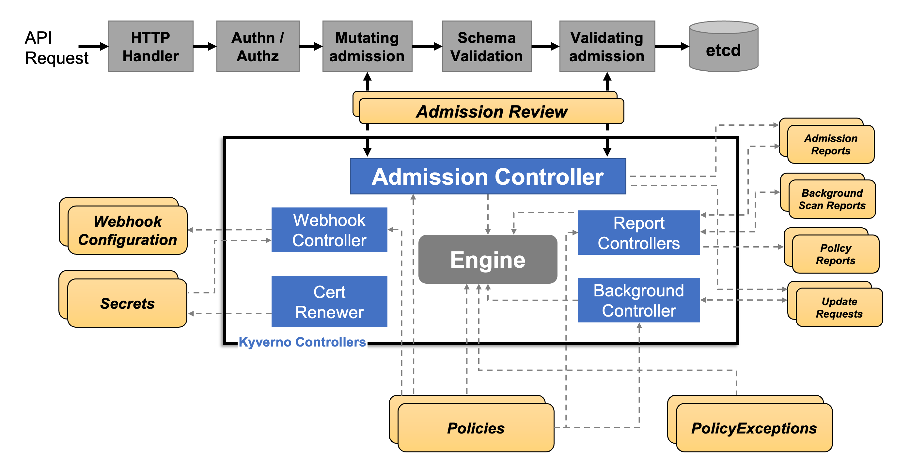

# Here we are!

## Multi-team tenancy with [Kyverno](https://kyverno.io/)

### What is kyverno?

Kyverno is a policy engine designed for Kubernetes platform engineering teams. 
It enables security, automation, compliance, and governance using policy-as-code. 

Kyverno can validate, mutate, generate, and cleanup configurations using Kubernetes admission controls, background scans, and source code respository scans. Kyverno policies can be managed as Kubernetes resources and do not require learning a new language. Kyverno is designed to work nicely with tools you already use like kubectl, kustomize, and Git.

### How kyverno works?



Kyverno runs as a dynamic admission controller.
It receives validating and mutating admission webhook HTTP callbacks from the Kubernetes API server and applies matching policies to return results that enforce admission policies or reject requests.

Kyverno enforce policies by matching resources by name, kind, label selectors and more.

Policy enforcement is captured using Kubernetes events. For requests that are either allowed or existed prior to introduction of a Kyverno policy, Kyverno creates Policy Reports in the cluster which contain a running list of resources matched by a policy, their status, and more.

Kyverno is composed by:

* The weebhook: handles incoming AdmissionReview requests from the Kubernetes API server and sends them to the Engine for processing.
* The Webhook Controller:watches the installed policies and modifies the webhooks to request only the resources matched by those policies. 
* The Cert Renewer: is responsible for watching and renewing the certificates, stored as Kubernetes Secrets, needed by the webhook.
* The Background Controller: handles all generate and mutate-existing policies by reconciling UpdateRequests, an intermediary resource. 
* The Report Controllers: handle creation and reconciliation of Policy Reports from their intermediary resources, Admission Reports and Background Scan Reports.


### Lab scenario

You've just been hired as a Kubernetes administrator and your new company is asking you to implement isolation on an cluster that will be actively used by two separate teams.

The IT security team places the condition on you to implement very specific policies with Kyverno, the new company standard.

Now the cluster is empty, waiting for you to set the new policies


In particular the objectives are:

* Establish a policy that prevents network communication between the two tenants

* Establish a policy that defines default quotas for each tenant

* Establish a policy that prevents the creation of pods without priority class across both tenant

* Establish a policy that require the definitions of a storageClass when creating a PVC

* Establish a policy that require the definitions of a reclaimPolicy when creating a storageClass

### Let's start!

[Before you begin, make sure you meet all the lab requirements](./labs-requirement.md)

## 0) Installation 

Let's install kyverno on the cluster using helm

First, add the kyverno helm repo

```
➜  ~ helm repo add kyverno https://kyverno.github.io/kyverno/
```

Scan the new repository for charts.

```
➜  ~ helm repo update
```

Install the kyverno chart

```
➜  ~ helm install kyverno kyverno/kyverno --values namespace-per-tenant/third-party/multi-team/kyverno/helm-values/kyverno-values.yaml -n kyverno --create-namespace
```

## 1) Establish a policy that prevents network communication between the two tenants

This policy will create a new NetworkPolicy resource named `default-deny` which will deny all traffic anytime a new Namespace is created.

```
➜  ~ kubectl apply -f - << EOF
apiVersion: kyverno.io/v1
kind: ClusterPolicy
metadata:
  name: add-networkpolicy
  annotations:
    policies.kyverno.io/title: Add Network Policy
    policies.kyverno.io/category: Multi-Tenancy, EKS Best Practices
    policies.kyverno.io/subject: NetworkPolicy
    policies.kyverno.io/minversion: 1.6.0     
spec:
  rules:
  - name: default-deny
    match:
      any:
      - resources:
          kinds:
          - Namespace
    generate:
      apiVersion: networking.k8s.io/v1
      kind: NetworkPolicy
      name: default-deny
      namespace: "{{request.object.metadata.name}}"
      synchronize: true
      data:
        spec:
          # select all pods in the namespace
          podSelector: {}
          # deny all traffic
          policyTypes:
          - Ingress
          - Egress
EOF
clusterpolicy.kyverno.io/add-networkpolicy created
```

Now, let's test the policy:

First, let's create two tenant

```
➜  ~ kubectl create namespace tenant-1
namespace/tenant-1 created

➜  ~ kubectl create namespace tenant-2
namespace/tenant-2 created
```

Now create an nginx pod exposed by a service on both tenant

```
➜  ~ kubectl run test-network-t1 --image nginx --port 80 --namespace tenant-1
pod/test-network-t1 created

➜  ~ kubectl run test-network-t2 --image nginx --port 80 --namespace tenant-2
pod/test-network-t2 created
```

```
➜  ~ kubectl expose pod test-network-t1 --name test-network-t1-svc --namespace tenant-1
service/test-network-t1-svc exposed

➜  ~ kubectl expose pod test-network-t2 --name test-network-t2-svc --namespace tenant-2
service/test-network-t2-svc exposed
```

try now to get the two pods to communicate

```
➜  ~ kubectl exec test-network-t1 --namespace tenant-1 -- curl  http://test-network-t2-svc.tenant-2 --connect-timeout 5
```

```
➜  ~ kubectl exec test-network-t2 --namespace tenant-2 -- curl  http://test-network-t1-svc.tenant-1 --connect-timeout 5
```

The two tests failed, the policy had the expected result

## 2) Establish a policy that defines default quotas for each tenant

This policy will generate ResourceQuota and LimitRange resources when a new Namespace is created.

```
➜  ~ kubectl apply -f - << EOF
apiVersion: kyverno.io/v1
kind: ClusterPolicy
metadata:
  name: add-ns-quota
  annotations:
    policies.kyverno.io/title: Add Quota
    policies.kyverno.io/category: Multi-Tenancy, EKS Best Practices
    policies.kyverno.io/subject: ResourceQuota, LimitRange
    policies.kyverno.io/minversion: 1.6.0     
spec:
  rules:
  - name: generate-resourcequota
    match:
      any:
      - resources:
          kinds:
          - Namespace
    generate:
      apiVersion: v1
      kind: ResourceQuota
      name: default-resourcequota
      synchronize: true
      namespace: "{{request.object.metadata.name}}"
      data:
        spec:
          hard:
            requests.cpu: '1'
            requests.memory: '2Gi'
            limits.cpu: '5'
            limits.memory: '16Gi'
  - name: generate-limitrange
    match:
      any:
      - resources:
          kinds:
          - Namespace
    generate:
      apiVersion: v1
      kind: LimitRange
      name: default-limitrange
      synchronize: true
      namespace: "{{request.object.metadata.name}}"
      data:
        spec:
          limits:
          - default:
              cpu: 1
              memory: 2Gi
            defaultRequest:
              cpu: 200m
              memory: 256Mi
            type: Container
EOF
clusterpolicy.kyverno.io/add-ns-quota created
```

Now let's try to create a new namespace and inspect it

```
➜  ~ kubectl create namespace testquota
namespace/testquota created
```

```
➜  ~ kubectl describe namespace testquota
```

The resource quotas were assigned automatically, the policy works

## 3) Establish a policy that prevents the creation of pods without priority class across both tenant

This policy requires that a Pod defines the priorityClassName field with some value.

```
➜  ~ kubectl apply -f - << EOF
apiVersion: kyverno.io/v1
kind: ClusterPolicy
metadata:
  name: require-pod-priorityclassname
  annotations:
    policies.kyverno.io/title: Require Pod priorityClassName
    policies.kyverno.io/category: Multi-Tenancy, EKS Best Practices
    policies.kyverno.io/severity: medium
    policies.kyverno.io/subject: Pod     
spec:
  validationFailureAction: Enforce
  background: true
  rules:
  - name: check-priorityclassname
    match:
      any:
      - resources:
          kinds:
          - Pod
    validate:
      message: "Pods must define the priorityClassName field."
      pattern:
        spec:
          priorityClassName: "?*"
EOF
clusterpolicy.kyverno.io/require-pod-priorityclassname created
```

To test the policy, let's try to create a pod with no priorityclass

```
➜  ~ kubectl run test-network-t2 --image nginx
```

The output is negative, the policy works

## 4) Establish a policy that require the definitions of a storageClass when creating a PVC

This policy requires that PVCs set storageClassName field with a value "tenant-<namespace-name>".

```
➜  ~ kubectl apply -f - << EOF
apiVersion: kyverno.io/v1
kind: ClusterPolicy
metadata:
  name: require-storageclass
  annotations:
    policies.kyverno.io/title: Require StorageClass
    policies.kyverno.io/category: Other, Multi-Tenancy
    policies.kyverno.io/severity: medium
    policies.kyverno.io/subject: PersistentVolumeClaim   
spec:
  validationFailureAction: Enforce
  background: true
  rules:
  - name: pvc-storageclass
    match:
      any:
      - resources:
          kinds:
          - PersistentVolumeClaim
    validate:
      message: "PersistentVolumeClaims must define a storageClassName."
      pattern:
        spec:
          storageClassName: "sc-{{request.object.metadata.namespace}}"
EOF
clusterpolicy.kyverno.io/require-storageclass created
```

Now lets try to create a basic pvc with the wrong storage-class name

```
➜  ~ kubectl apply -f - << EOF
apiVersion: v1
kind: PersistentVolumeClaim
metadata:
  name: test-pvc
spec:
  accessModes:
    - ReadWriteOnce
  resources:
    requests:
      storage: 8Gi
  storageClassName: sc-foo
  volumeName: foo-pv
EOF
```

The policy succesfully block the resource creation


## 5) Establish a policy that require the definitions of a reclaimPolicy when creating a storageClass

This policy requires StorageClasses set a reclaimPolicy of `Delete`

```
➜  ~ kubectl apply -f - << EOF
apiVersion: kyverno.io/v1
kind: ClusterPolicy
metadata:
  name: restrict-storageclass
  annotations:
    policies.kyverno.io/title: Restrict StorageClass
    policies.kyverno.io/category: Other, Multi-Tenancy
    policies.kyverno.io/severity: medium
    policies.kyverno.io/subject: StorageClass    
spec:
  validationFailureAction: Enforce
  background: true
  rules:
  - name: storageclass-delete
    match:
      any:
      - resources:
          kinds:
          - StorageClass
    validate:
      message: "StorageClass must define a reclaimPolicy of Delete."
      pattern:
        reclaimPolicy: Delete
EOF
clusterpolicy.kyverno.io/restrict-storageclass created
```

Let's create a storage class to test the policy

```
➜  ~ kubectl apply -f - << EOF
apiVersion: storage.k8s.io/v1
kind: StorageClass
metadata:
  name: test-local-storage
provisioner: kubernetes.io/no-provisioner
reclaimPolicy: Retain
volumeBindingMode: WaitForFirstConsumer
EOF
```

The storage class creation is blocked, the policy works