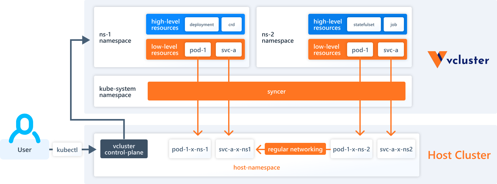
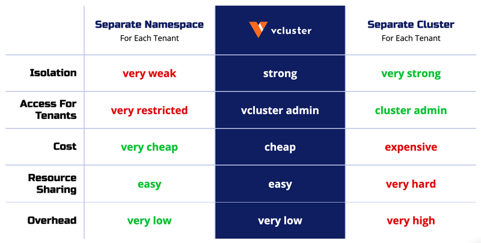

# Here we are!

## Multi tenancy by Virtual Control Plane by [vCluster](https://github.com/loft-sh/vcluster)


### What is vCuster?

vcluster itself is a certified Kubernetes distribution and is 100% Kubernetes API conform. Everything that works in a regular Kubernetes cluster works in vcluster

Virtual clusters are fully working Kubernetes clusters that run on top of other Kubernetes clusters. Compared to fully separate "real" clusters, virtual clusters reuse worker nodes and networking of the host cluster. 

They have their own control plane and schedule all workloads into a single namespace of the host cluster. Like virtual machines, virtual clusters partition a single physical cluster into multiple separate ones.

### How vCuster works?

They have their own control plane and schedule all workloads into a single namespace of the host cluster. Like virtual machines, virtual clusters partition a single physical cluster into multiple separate ones.

The virtual cluster itself only consists of the core Kubernetes components: API server, controller manager, storage backend (such as etcd, sqlite, mysql etc.) and optionally a scheduler. To reduce virtual cluster overhead, vCluster builds by default on k3s, which is a fully working, certified, lightweight Kubernetes distribution that compiles the Kubernetes components into a single binary and disables by default all unneeded Kubernetes features, such as the pod scheduler or certain controllers.



### Why use vCuster?

Because you can have many virtual clusters within a single cluster, they are much cheaper than the traditional Kubernetes clusters, and they require lower management and maintenance efforts. This makes them ideal for running experiments, continuous integration, and setting up sandbox environments.

Finally, virtual clusters can be configured independently of the physical cluster. This is great for multi-tenancy, like giving your customers the ability to spin up a new environment or quickly setting up demo applications for your sales team.



### The lab scenario

You've just been hired as a Kubernetes admin and your new company asks you to set up a single Kubernetes cluster to be used by many separate teams.
No limitations were placed on you, so you decide to try multi tenancy by Virtual Control Plane using vCluster

In particular the objectives are:

* Deploy vCluster
* Test how vcluster works and how it handles isolation

---

### Let's start!

[Before you begin, make sure you meet all the lab requirements](./labs-requirement.md)

## 0)  Installation 

First, let's install the vcluster cli by running this command:

```
➜  ~ curl -L -o vcluster "https://github.com/loft-sh/vcluster/releases/latest/download/vcluster-linux-amd64" && sudo install -c -m 0755 vcluster /usr/local/bin && rm -f vcluster
```

Now, check if the cli has been sucessfully  installed

```
➜  ~ vcluster --version
```

## 1)  Create the tenants virtual clusters 

vCluster provides various ways to deploy virtual clusters:

* deploy from the vCluster cli
* deploy with helm
* deploy with kubectl

In this lab, we will take advantage of the practical helm chart made available

First, add the vCluster chart repo

```
➜  ~ helm repo add loft-sh https://charts.loft.sh
➜  ~ helm repo update
```

Then, deploy a new helm release fow each tenant(vc) you want to create:

```
➜  ~ helm upgrade tenant-1 loft-sh/vcluster -n vcluster-tenant-1 --values virtual-control-plane/vcluster/vcluster-valuefiles/tenant-1.yaml --create-namespace --install
```

```
➜  ~ helm upgrade tenant-2 loft-sh/vcluster -n vcluster-tenant-2 --values virtual-control-plane/vcluster/vcluster-valuefiles/tenant-2.yaml --create-namespace --install
```

Now let's check if the two virtual clusters have been created successfully on the host cluster

```
➜  ~ kubectl get namespace                                                                                                minikube
```

```
➜  ~ kubectl get pod --namespace vcluster-tenant-1                                                                        minikube
NAME                                                READY   STATUS    RESTARTS   AGE
coredns-68bdd584b4-k48jf-x-kube-system-x-tenant-1   1/1     Running   0          8m56s
tenant-1-0                                          1/1     Running   0          9m25s
```

```
➜  ~ kubectl get pod --namespace vcluster-tenant-2                                                                        minikube
NAME                                                READY   STATUS    RESTARTS   AGE
coredns-68bdd584b4-2x8kv-x-kube-system-x-tenant-2   1/1     Running   0          19m
tenant-2-0                                          1/1     Running   0          20m
```

## 2)  Access the virtual clusters tenants

Now that the two tenants have been created, all we have to do is access them

To do this, we can use the dedicated command made available by the vcluster cli

```
➜  ~ vcluster connect tenant-1
```

This command will give us access to the chosen virtual cluster by exporting the kubeconfig from the virtual cluster pod NodePort service

Let's check if the previous command has successfully worked

```
➜  ~ kubectl config current-context
```

We are now officially connected to the tenant-1 virtual cluster

Let's now try to connect to tenant-2

```
➜  ~ vcluster connect tenant-2
```

Let's check if the connection was successful

```
➜  ~ kubectl config current-context
```

Everything worked correctly

## 3) Virtual clusters tenants workload management

Now that we have our virtual clusters, we can try scheduling some workloads

Let's connect to the tenant-1 virtual cluster 

```
➜  ~ vcluster connect tenant-1
```

Create a namespace called "test"

```
➜  ~ kubectl create namespace test
```

Now deploy a workload as we would on a standard cluster

```
➜  ~ kubectl run nginx --image nginx -n test                                            vcluster_tenant-1_vcluster-tenant-1_minikube
```

And check the pod status

```
➜  ~ kubectl get pod -n test                                                            vcluster_tenant-1_vcluster-tenant-1_minikube
NAME    READY   STATUS    RESTARTS   AGE
nginx   1/1     Running   0          11s
```

The pod is running, let's check how this workload is operated on the host cluster

Now return on the host cluster

```
➜  ~ vcluster disconnect
```

Now get all the pod from the tenant namespace

```
➜  ~ kubectl get pod -n vcluster-tenant-1                                               minikube
```

As we can see, the workloads are directly visible on the cluster host

But cluster wide resources?

Let's see how they are managed

Let's reconnect to the tenant 1 virtual cluster

```
➜  ~ vcluster connect tenant-1
```

Create a cluster wide resource, in this case a clusterRole

```
➜  ~ kubectl create clusterrole test --verb get --resource pod                         cluster_tenant-1_vcluster-tenant-1_minikube
```

Now check if the clusterRole has been created

```
➜  ~ kubectl get clusterrole                                                           cluster_tenant-1_vcluster-tenant-1_minikube
```

Now, return on the host cluster

```
➜  ~ vcluster disconnect
```

And check all the clusterroles resources

```
➜  ~ kubectl get clusterrole                                                            minikube
```

As we can see, the clusterrole "test" does not exist as a resource in the host cluster

This is because the virtual cluster uses the host cluster only for workload execution and networking, while virtualizing all high-level cluster wide resources

## 4) Virtual clusters tenants networking isolation

Basically all the dataplane resources are synced and based on the host cluster. 

For this reason, for example, by default no type of isolation is enabled at the network level (except dns).

Let's go check it out

Let's expose the nginx pod that we had previously created on tenant-1 with a clusterIp service

First let's connect to tenant-1

```
➜  ~ vcluster connect tenant-1
```

Then we expose the pod

```
➜  ~ kubectl expose pod nginx --name nginx-service-tenant-1 --port 80 -n test
```

Now let's replicate this configuration also on tenant-2

```
➜  ~ vcluster connect tenant-2
```

```
➜  ~ kubectl create namespace test
```

```
➜  ~ kubectl run nginx --image nginx -n test
```

```
➜  ~ kubectl expose pod nginx --name nginx-service-tenant-2 --port 80 -n test
```

We can now try to make the two pods comunicate

from tenant 1

```
➜  ~ kubectl exec nginx --namespace test -- curl <nginx-tenant-1-svc-ip> 
```

from tenant 2

```
➜  ~ kubectl exec nginx --namespace test -- curl <nginx-tenant-2-svc-ip> 
```

The tests are positive, no type of isolation is enabled at the network level.

However, vcluster provides a configuration section in the helm chart valuefile to enforce isolation at the dataplane level.

Let's look at this segment in the value file! [tenant-1 valuefile - Line 435](./vcluster-valuefiles/tenant-1.yaml)


Now let's create two new virtual clusters called tenant-3 and tenant-4, where the isolation parameters are been enabled

```
➜  ~ helm upgrade tenant-3-isolated loft-sh/vcluster -n vcluster-tenant-3-isolated --values virtual-control-plane/vcluster/vcluster-valuefiles/tenant-3-isolated.yaml --create-namespace --install
```

```
➜  ~ helm upgrade tenant-4-isolated loft-sh/vcluster -n vcluster-tenant-4-isolated --values virtual-control-plane/vcluster/vcluster-valuefiles/tenant-4-isolated.yaml --create-namespace --install
```

Now let's replicate the configuration to test the networking between the two tenants starting from tenant-3-isolated

```
➜  ~ vcluster connect tenant-3-isolated
```

```
➜  ~ kubectl create namespace test
```

```
➜  ~ kubectl run nginx --image nginx -n test
```

```
➜  ~ kubectl expose pod nginx --name nginx-service-tenant-3 --port 80 -n test
```

And then passing on tenant-4 isolated

```
➜  ~ vcluster connect tenant-4-isolated
```

```
➜  ~ kubectl create namespace test
```

```
➜  ~ kubectl run nginx --image nginx -n test
```

```
➜  ~ kubectl expose pod nginx --name nginx-service-tenant-4 --port 80 -n test
```

Now it's the moment of truth, let's take the networking test

```
➜  ~ kubectl exec nginx --namespace test -- curl <nginx-tenant-4-svc-ip> --connect-timeout 5
```

from tenant 4

```
➜  ~ kubectl exec nginx --namespace test -- curl <nginx-tenant-3-svc-ip> --connect-timeout 5
```

Now the tests are negative, isolation at the networking level has been achieved

## 5) Virtual clusters tenants storage isolation

Like all dataplane resources, the physical management of storage also falls on the cluster host.

The isolation is implemented by the syncer, which, through filtering the names of the resources, prevents a tenant from interacting with the storage resources of another tenant

But let's see in detail:

Let's create a normal storage stack on the tenant-3 virtual cluster

Starting with the storage class

```
➜  ~ kubectl apply -f - << EOF
apiVersion: storage.k8s.io/v1
kind: StorageClass
metadata:
  name: tenant-3-storage-class
provisioner: kubernetes.io/no-provisioner
EOF
```

Then we can create the persistent volume

```
➜  ~ kubectl apply -f - << EOF
apiVersion: v1
kind: PersistentVolume
metadata:
  name: tenant-3-persistent-volume
spec:
  volumeMode: Filesystem
  capacity:
    storage: 500Mi
  accessModes:
    - ReadWriteMany
  storageClassName: tenant-3-storage-class
  hostPath:
    path: "/tenant-3/data"
EOF
```

And then the persistent volume claim

```
➜  ~ kubectl apply -f - << EOF
apiVersion: v1
kind: PersistentVolumeClaim
metadata:
  name: tenant-3-persistent-volume-claim
  namespace: test
spec:
  accessModes:
    - ReadWriteMany
  volumeMode: Filesystem
  resources:
    requests:
      storage: 10Mi
  storageClassName: tenant-3-storage-class
EOF
```

Now let's check that the persistent volume claim has fulfilled the bound

```
➜  ~ kubectl get persistentvolumeclaims -n test
```

The claim is bound, everything is ok.

What if a member of tenant-4, despite not seeing the storage class of tenant-3, wants to try to use it?

Let's try to create a claim on tenant 4 that points to the storage class of tenant-3

```
➜  ~ kubectl apply -f - << EOF
apiVersion: v1
kind: PersistentVolumeClaim
metadata:
  name: tenant-4-persistent-volume-claim
  namespace: test
spec:
  accessModes:
    - ReadWriteMany
  volumeMode: Filesystem
  resources:
    requests:
      storage: 10Mi
  storageClassName: tenant-3-storage-class
EOF
```

Let's check the status of the claim

```
➜  ~ kubectl get persistentvolumeclaims -n test
```

The claim remains pending under the heading "storage-class not found"

## 6) Virtual clusters tenants isolation of workloads by node

Besides this basic workload isolation, you could also dive into more advanced isolation methods, such as isolating the workloads on separate nodes or through another container runtime. Using different nodes for your vCluster workloads can be accomplished through the --node-selector flag on vCluster syncer.

[See the nodeSelector param - line 80](./vcluster-valuefiles/tenant-3-isolated.yaml)


## 7) Virtual clusters tenants roles and access management

vCluster manages roles and RBAC like a normal kubernetes cluster.

We can therefore authenticate a user on a virtual cluster simply by having him submit a certificate signing request and then manage is permissions by assigning it to a role with a roleBinding or a clusterrole with a clusterRolebinding.

Let's try:

As the host cluster admin, we log in to a virtual cluster.

```
➜  ~ vcluster connect tenant-3-isolated
```

A user who is part of the team asks us to sign his certificate so he can log in to the virtual cluster

To simulate the user we use the csr script already seen in the other labs

```
➜  ~ ./namespace-per-tenant/third-party/multi-team/capsule/users-credentials/create-user.sh marco tenant-3 sunnyvale
```

The user logs in and tries to get the pods

```
➜  ~ kubectl get pod                                                                                       marco-tenant-2
Error from server (Forbidden): pods is forbidden: User "marco" cannot list resource "pods" in API group "" in the namespace "default"
```

Since we have not assigned any role to the user, the operation is denied

We then proceed to assign the default cluster role "admin" to the user

```
➜  ~ kubectl create clusterrolebinding admin-binding --clusterrole admin --user marco
```

Now the user tries to perform the same operation

```
➜  ~ kubectl get pod                                                                                       marco-tenant-2
No resources found in default namespace.
```

This demonstrate that although the clusters are virtualized, the user experience remains the classic Kuberntes one